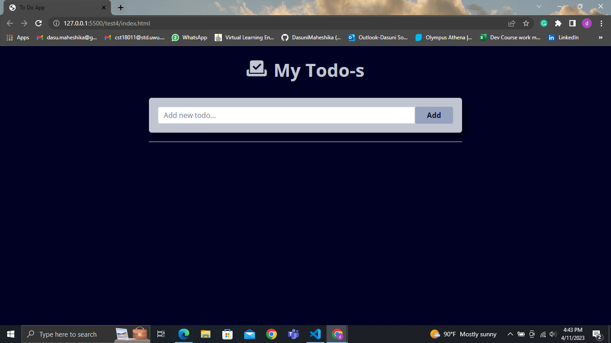
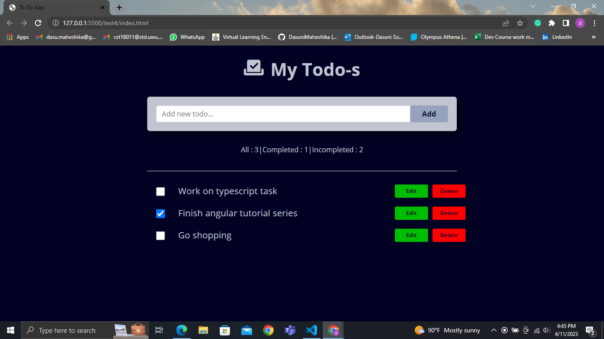
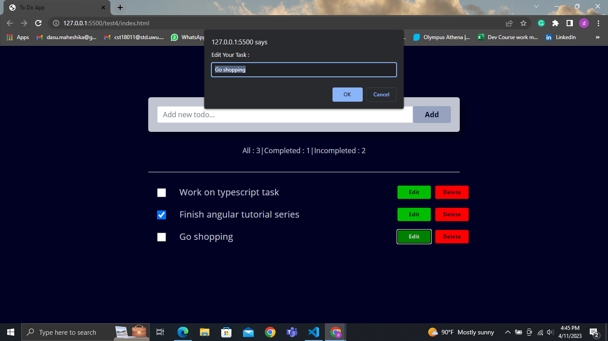

# Todo-App using TypeScript

TO-DO app is a simple project that is created using TypeScript. This is the perfect project for beginner web developers who are looking to expand their knowledge of HTML CSS and TypeScript.

## Key features

- Add to-do items
- Delete to-do items
- Edit to-do items
- Mark tasks as complete or incomplete using checkbox
- Show all, completed and incompleted task count

## Built with

- HTML
- CSS
- TypeScript

## How to use

1. Clone the project
2. Open the index.html file in your web browser
3. To add a new task, enter the task in input field and then click 'Add' button.
4. To edit a task, click the 'Edit' button next to the task name and then edit the name which display in the promt and click 'OK' button.
5. To delete a task, click the 'Delete' button next to the task name.
6. To mark as complete, click the checkbbox near to particular task.

## Sample images

* First interface,

  

* When mark the completed tasks, then completed and incompleted tasks count will appear,

  

* When click the Edit button,

  

